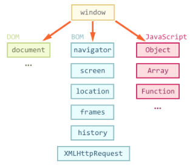

# Документ, события, интерфейсы

**Окружение**



`window.navigator` - содержит общую информацию о браузере и операционной системе  
`window.location.href` - содержит информацию о текущем URL  

**Навигация**  
Включает текстовые узлы:  
  

Только по элементам  
 

Особая навигация есть по таблицам и формам  


* `elem.matches(css)` - проверяет, удовлетворяет ли элемент CSS-селектору  
* `elem.closest(css)` - ближайший вверх по DOM


**Коллекции** 
DOM-коллекции, такие как `childNodes` не являются JavaScript-массивами.  
Можно для перебора коллекции использовать обычный цикл `for(var i=0; i<elems.length; i++)`  

или сделать из коллекции массив:  
```
var elems = document.documentElement.childNodes;

[].forEach.call(elems, function(elem) {
  alert( elem ); // HEAD, текст, BODY
});
```
or   
```
var elems = document.documentElement.childNodes;
elems = Array.prototype.slice.call(elems); // теперь elems - массив
```

______________________________________________

id создает в глобальной области видимости объект

document.querySelector('');  

# Ресурсы 

* [Шпаргалка по работе с DOM от Мезина](https://github.com/AnastasiyaDev/learn.javascript/blob/master/assets/dom.pdf)