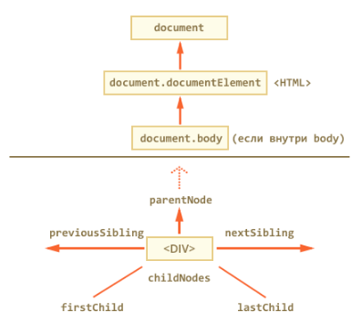

# Документ, события, интерфейсы

### Окружение


`window.navigator` - содержит общую информацию о браузере и операционной системе  
`window.location.href` - содержит информацию о текущем URL  

### Навигация

Включает текстовые узлы:  
  

Только по элементам  
 
 


* `elem.matches(css)` - проверяет, удовлетворяет ли элемент CSS-селектору  
* `elem.closest(css)` - ближайший вверх по DOM  

**Особая навигация у таблиц и форм**

### Коллекции  

DOM-коллекции, такие как `childNodes` не являются JavaScript-массивами.  
Можно для перебора коллекции использовать обычный цикл `for(var i=0; i<elems.length; i++)`  

или сделать из коллекции массив:  
```
var elems = document.documentElement.childNodes;

[].forEach.call(elems, function(elem) {
  alert( elem ); // HEAD, текст, BODY
});
```
or   
```
var elems = document.documentElement.childNodes;
elems = Array.prototype.slice.call(elems); // теперь elems - массив
```  

### Атрибуты и DOM-свойства

  

Для классов  

* `className` - возвращает классы в виде строки  
* `classList` - объект (IE+, для IE8+ библиотека [classList.js](https://github.com/eligrey/classList.js))  
* `elem.classList.contains("class")` – возвращает true/false, в зависимости от того, есть ли у элемента класс `class`  
* `elem.classList.add/remove("class")` – добавляет/удаляет класс `class`  
* `elem.classList.toggle("class")` – если класса `class` нет, добавляет его, если есть – удаляет.  

Есть поддержка (IE10+) особенного обращения к `data`-атрибутам:  
* `data-user-location="street"` - атрибут, доступ к нему: `elem.dataset.userLocation`  


В отличие от свойств, атрибуты:  
* Всегда являются строками.  
* Их имя нечувствительно к регистру (ведь это HTML)  
* Видны в innerHTML (за исключением старых IE)  

**Всегда пользуемся свойствами, кроме:**  
1. Кастомные атрибуты  
2. Когда нужно получить «оригинальное значение» стандартного HTML-атрибута, например, `<input value="...">`  
3. Когда нужно получить список всех атрибутов, включая пользовательские. Для этого используется коллекция `attributes`  

### Создание и вставка DOM-узлов
Методы для создания узлов:  
* `document.createElement(tag)` – создает элемент  
* `document.createTextNode(value)` – создает текстовый узел  
* `elem.cloneNode(deep)` – клонирует элемент, если `deep == true`, то со всеми потомками  

Вставка и удаление узлов:  
* `parent.appendChild(elem)`  
* `parent.insertBefore(elem, nextSibling)`  
* `parent.removeChild(elem)`  
* `parent.replaceChild(newElem, elem)`  

`elem.insertAdjacentHTML(where, html);` - позволяет вставить строку содержащую HTML в любое место документа относительно `elem`

Методы из нового стандарта:  
* `node.append(...nodes)` – вставляет `nodes` в конец `node`  
* `node.prepend(...nodes)` – вставляет `nodes` в начало `node`  
* `node.after(...nodes)` – вставляет `nodes` после узла `node`  
* `node.before(...nodes)` – вставляет `nodes` перед узлом `node`  
* `node.replaceWith(...nodes)` – вставляет `nodes` вместо `node`  

______________________________________________

id создает в глобальной области видимости объект


# Ресурсы 

* [Шпаргалка по работе с DOM от Мезина](https://github.com/AnastasiyaDev/learn.javascript/blob/master/assets/dom.pdf)
